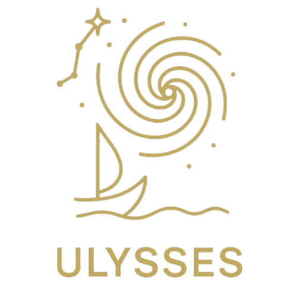

<p align="center">
  
</p>

#  ULYSSES: Universal LeptogeneSiS Equation Solver

[](https://opensource.org/licenses/MIT)
[](https://ulysses-universal-leptogenesis-equation-solver.readthedocs.io/en/latest/)


## 📘 Introduction

**ULYSSES** is an open-source Python package designed to compute the baryon asymmetry of the Universe through **leptogenesis**, within the **type-I seesaw** framework. It numerically solves the momentum-averaged **Boltzmann equations (BEs)** or **quantum density matrix equations (DMEs)** that govern the evolution of particle asymmetries in the early Universe.

The package features:
- Fast and modular solver infrastructure
- Flexible physics model input via plugin system
- Full compatibility with user-defined scenarios

It is documented across two key publications:
- [Version 1 – arXiv:2007.09150](https://arxiv.org/abs/2007.09150)
- [Version 2 – arXiv:2301.05722](https://arxiv.org/abs/2301.05722)

---

## 🌌 Scientific Background

The baryon asymmetry is measured as the baryon-to-photon ratio:  

$$\eta_B \approx 6 \times 10^{-10}$$

**Leptogenesis** explains this asymmetry via CP-violating decays of heavy right-handed neutrinos (RHNs) in the early Universe. These decays produce a net lepton number, which electroweak sphalerons convert to baryon number.

ULYSSES implements this through coupled differential equations:

$$\frac{dN_N}{dz} = -D (N_N - N_N^{\text{eq}}), \quad \frac{dN_{B-L}}{dz} = \varepsilon D (N_N - N_N^{\text{eq}}) - W N_{B-L}$$

with temperature parameter $$z = M_1 / T$$.

---

## 🧠 Core Features

### Version 1 (v1) – Foundational (arXiv:2007.09150)
- Momentum-averaged BEs
- Flavored/unflavored solvers
- Resonant leptogenesis
- Optional scatterings and spectators
- Plugin-based model extensions

### Version 2 (v2) – Major Enhancements (arXiv:2301.05722)
- **ARS** (low-scale) leptogenesis
- **Primordial black hole** (PBH) leptogenesis
- **"Complete" BEs** with kinetic and quantum statistics
- Preconfigured 2D scans for parameter space exploration

---

## ⚙️ Installation

### 📦 PyPI (Recommended)
```bash
pip install ulysses --user
```
### 🛠 From Source (for developers)

If you intend to modify the source code or contribute to the project, you should install
the package from a local clone of the GitHub repository:

1. Clone the repository from GitHub:
```bash
git clone https://github.com/earlyuniverse/ulysses.git
```
2. Navigate into the newly created directory:
```bash
cd ulysses
```
3. Install the package in editable mode using pip:
```bash
pip install. --user
```
### 🔧 Environment Setup (optional)

Add to your ~/.bashrc or ~/.zshrc:

```bash
export ULYSSES=/path/to/ulysses
export PYTHONPATH=$PYTHONPATH:$ULYSSES
export PATH=$PATH:$ULYSSES/bin
```
## 🚀 Quick Start

### Step 1: Create a parameter file my_first_run.dat

```ini
#Lightest Neutrino mass (log10(eV))
m -100
#RHN Mass (log10(GeV))
M1 14
M2 15
M3 16
#Casas-Ibarra Parameters
x1 180
y1 0.4
x2 180
y2 11.2
x3 180
y3 11
#PMNS Parameters
delta 0.0
a21 0
a31 0
t23 49.7
t12 33.82
t13 8.610000

```
### Step 2: Run a simulation

```bash
uls-calc -m 1BE1F examples/my_first_run.dat -o my_first_run.pdf
```
## 🧪 Advanced Usage

ULYSSES includes a suite of command-line tools located in the `bin/` directory to support a variety of parameter-space analyses:

| Command       | Description                                                                 |
|---------------|-----------------------------------------------------------------------------|
| `uls-calc`    | Computes a single-point evolution of the asymmetry using a parameter card. |
| `uls-scan`    | Performs a 1D scan over a user-defined parameter range.                     |
| `uls-scan2D`  | Performs a 2D grid scan over two input parameters (introduced in v2).       |
| `uls-nest`    | Launches a nested sampling scan for Bayesian inference or model selection.  |
| `uls-models`  | Displays a list of available pre-defined physics models (`-m` flags).       |

---

## 📊 Table of Available Physics Models

Below is the full list of built-in physics models available in ULYSSES, along with example input files and a short description:

| Model       | Example Input File | Description                                               |
|-------------|--------------------|-----------------------------------------------------------|
| `1DME`      | `1N3F.dat`         | DME with 1 RHN                                            |
| `2DME`      | `2N3F.dat`         | DME with 2 RHNs                                           |
| `3DME`      | `3N3F.dat`         | DME with 3 RHNs                                           |
| `1BE1F`     | `1N1F.dat`         | One-flavour BE with 1 RHN                                 |
| `1BE2F`     | `1N2F.dat`         | Two-flavour BE with 1 RHN                                 |
| `1BE3F`     | `1N3F.dat`         | Three-flavour BE with 1 RHN                               |
| `2BE1F`     | `2N1F.dat`         | One-flavour BE with 2 RHNs                                |
| `2BE2F`     | `2N2F.dat`         | Two-flavour BE with 2 RHNs                                |
| `2BE3F`     | `2N3F.dat`         | Three-flavour BE with 2 RHNs                              |
| `3DME_sct`  | `3N3F.dat`         | DME with 3 RHNs including scattering effects              |
| `1BE1Fsf`   | `1N1F.dat`         | 1BE1F evolving in scale factor                            |
| `2RES`      | `Res.dat`          | 2BE3F in the resonant regime                              |
| `2RESsp`    | `Res.dat`          | 2RES including spectator processes                        |
| `2RESsp`    | `Res.dat`          | 2RES including spectator processes                        |
| `BEARS`     | `2RHNosc.dat`      | Temperature Independent ARS                                |
| `BEARS_INTERP` | `2RHNosc.dat`      | Temperature Dependent ARS                                |

---

## 📚 Citation

Please cite both papers where appropriate, depending on which features you use:

### For ULYSSES v1:
```bibtex
@article{Granelli:2020pim,
    author = "Granelli, Alessandro and Moffat, Kristian and Perez-Gonzalez, Yuber F. and Schulz, Holger and Turner, Jessica",
    title = "{ULYSSES: Universal LeptogeneSiS Equation Solver}",
    eprint = "2007.09150",
    archivePrefix = "arXiv",
    primaryClass = "hep-ph",
    reportNumber = "FERMILAB-PUB-20-275-T, SISSA 17/2020/FISI, IPPP/20/30",
    doi = "10.1016/j.cpc.2020.107813",
    journal = "Comput. Phys. Commun.",
    volume = "262",
    pages = "107813",
    year = "2021"
}
```
### For ULYSSES v2:
```bibtex
@article{Granelli:2023vcm,
    author = "Granelli, Alessandro and Leslie, Christopher and Perez-Gonzalez, Yuber F. and Schulz, Holger and Shuve, Brian and Turner, Jessica and Walker, Rosie",
    title = "{ULYSSES, universal LeptogeneSiS equation solver: Version 2}",
    eprint = "2301.05722",
    archivePrefix = "arXiv",
    primaryClass = "hep-ph",
    reportNumber = "IPPP/23/02",
    doi = "10.1016/j.cpc.2023.108834",
    journal = "Comput. Phys. Commun.",
    volume = "291",
    pages = "108834",
    year = "2023"
}
```
## 📖 Further Documentation, License, and Contributing

### 📑 Documentation

ULYSSES is thoroughly documented across both scientific publications and auto-generated developer docs:

- 📘 **Version 1 Manual**: [arXiv:2007.09150](https://arxiv.org/abs/2007.09150)  
  *Foundational features and physics assumptions (BEs, resonant leptogenesis, etc.).*
  
- 📗 **Version 2 Manual**: [arXiv:2301.05722](https://arxiv.org/abs/2301.05722)  
  *Extended features: complete Boltzmann equations, ARS mechanism, PBH module, and 2D scans.*

- 📚 **API Documentation**: [Read the Docs](https://ulysses-universal-leptogenesis-equation-solver.readthedocs.io/)  
  *Auto-generated documentation for the Python API and class structure.*

---

### 🪪 License

ULYSSES is licensed under the **MIT License**, a permissive open-source license.  
You are free to use, modify, and distribute the software, provided the license terms are respected.

See the [LICENSE file](https://github.com/earlyuniverse/ulysses/blob/main/LICENSE) for full details.

---

### 🤝 Contributing

We welcome and encourage contributions from the community! You can help by:

- Reporting bugs or feature requests via [GitHub Issues](https://github.com/earlyuniverse/ulysses/issues)
- Submitting pull requests for code fixes, model implementations, or documentation
- Sharing new physics modules via the plugin architecture

For major changes, please open a discussion before proceeding. Ensure all code follows the repository’s formatting and documentation style.

---

## 🔗 Useful Links

- 💻 **GitHub Repository**: [earlyuniverse/ulysses](https://github.com/earlyuniverse/ulysses)
- 📄 **arXiv:2007.09150** – ULYSSES v1: [link](https://arxiv.org/abs/2007.09150)
- 📄 **arXiv:2301.05722** – ULYSSES v2: [link](https://arxiv.org/abs/2301.05722)
- 📘 **Documentation (ReadTheDocs)**: [link](https://ulysses-universal-leptogenesis-equation-solver.readthedocs.io/)

---
